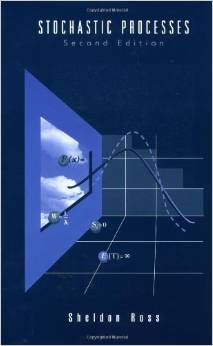
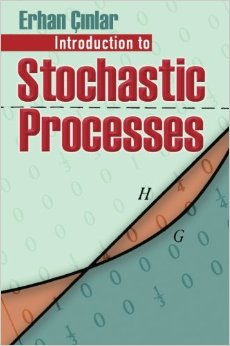
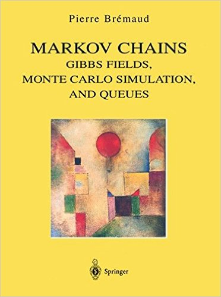
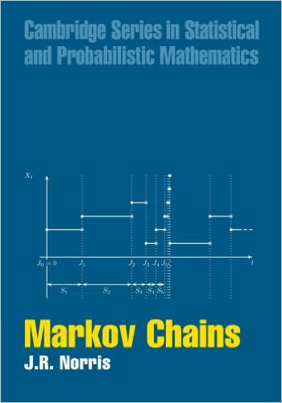
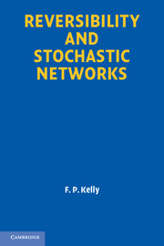
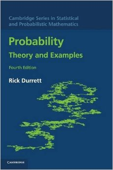

## Spring 2022

## Lecture Notes

- 04 Jan 2022: Lecture-01 [Introduction](lecture-01.pdf)
- 06 Jan 2022: Lecture-02 [Probability Review](lecture-02.pdf)
- 11 Jan 2022: Lecture-03 [Conditional Expectation](lecture-03.pdf)
- 13 Jan 2022: Lecture-04 [Stochastic Processes](lecture-04.pdf)
- 18 Jan 2022: Lecture-05 [Stopping Times](lecture-05.pdf )
- 20 Jan 2022: Lecture-06 [Strong Markov Property](lecture-06.pdf)
- 25 Jan 2022: Lecture-07 [Renewal Processes](lecture-07.pdf)
- 27 Jan 2022: Lecture-08 [Distribution Functions](lecture-08.pdf)
- 01 Feb 2022: Lecture-09 [Limit Theorems](lecture-09.pdf)
- 03 Feb 2022: Lecture-10 [Regenerative Processes](lecture-10.pdf)
- 08 Feb 2022: Lecture-11 [Blackwell's Theorem](lecture-11.pdf)
- 10 Feb 2022: Lecture-12 [Key Renewal Theorem](lecture-12.pdf)
- 15 Feb 2022: Lecture-13 [Key Renewal Theorem: Applications](lecture-13.pdf )
- 17 Feb 2022: Lecture-14 [Renewal Reward Process](lecture-14.pdf )
- 22 Feb 2022: Lecture-15 [Discrete Time Markov Chains](lecture-15.pdf )
- 24 Feb 2022: Lecture-16 [DTMC: Invariant Distribution](lecture-16.pdf )
- 01 Mar 2022: Lecture-17 [Continuous Time Markov Chains](lecture-17.pdf)
- 03 Mar 2022: Lecture-18 [CTMC: Embedded Markov Chain and Jump Times](lecture-18.pdf)
- 08 Mar 2022: Lecture-19 [CTMC: Stationarity](lecture-19.pdf)
- 10 Mar 2022: Lecture-20 [Reversibility](lecture-20.pdf)
- 15 Mar 2022: Lecture-21 [Queues](lecture-21.pdf)
- 17 Mar 2022: Lecture-22 [Reversed Processes](lecture-22.pdf)
- 22 Mar 2022: Lecture-23 [Stochastic Networks](lecture-23.pdf)
- 24 Mar 2022: Lecture-24 [Martingales: Introduction](lecture-24.pdf)
- 29 Mar 2022: Lecture-25 [Martingales: Convergence Theorem](lecture-25.pdf)
- 31 Mar 2022: Lecture-25 [Martingales: Concentration Inequalities](lecture-25.pdf)
- 05 Apr 2022: Lecture-26 [Exchangeability](lecture-26.pdf)
- 07 Apr 2022: Lecture-27 [Random Walks](lecture-27.pdf)
- 12 Apr 2022: Lecture-28 [GI/G/1 Queues](lecture-28.pdf)
- Download [all lectures](all-lectures.pdf).

## Homeworks
- 06 Jan 2022: [Homework-01](homework-01.pdf)
- 20 Jan 2022: [Homework-02](homework-02.pdf)
- 03 Feb 2022: [Homework-03](homework-03.pdf)
- 17 Feb 2022: [Homework-04](homework-04.pdf)
- 03 Mar 2022: [Homework-05](homework-05.pdf)
- 17 Mar 2022: [Homework-06](homework-06.pdf)
- 31 Mar 2022: [Homework-07](homework-07.pdf)
- 14 Apr 2022: [Homework-08](homework-08.pdf)

## Tests 
- 12 Feb 2022: Mid Term 1
- 26 Mar 2022: Mid Term 2
- 26 Apr 2022: Final (09:00am-12:00noon) 

## Grading Policy
Mid Terms: 40
Homeworks: 30
Final	 : 30

## Course Syllabus
Poisson process, Renewal theory, Markov chains, Reversibility, Queueing networks, Martingales, Random walk. 

#[PDF]

## Course Description
Basic mathematical modeling is at the heart of engineering. 
In both electrical and computer engineering, many complex systems are modeled using stochastic processes. 
This course will introduce students to basic stochastic processes tools that can be utilized for performance analysis and stochastic modeling of dynamic systems and networks. 

 
## Teams/GitHub Information
{::comment}
### Slack Information
#### Slack
#Students can signup for course slack using their iisc.ac.in email at [https://courses-ece-iisc.slack.com/signup Slack signup]. 
#Add yourself to the public channel \#spqt-2022.
{:/comment}

### Teams 
We will use Microsoft Teams for all the course related communication.
*Please do not send any email regarding the course.* 
You can signup for the course team Stochastic-Processes-2022 using the following code *swzjpss*.

{::comment}
#To be on the course team, you have to be formally registered for the course.
#If you are registered for the course and not on the course team Foundations-Machine-Learning-2022, please send me a direct message on Teams.
{:/comment}

#### GitHub
All the students in the class have read access to [Stochastic-Processes](https://github.com/TeachingReps/Stochastic-Processes) public repository on GitHub.  
Please follow the guidelines in the [sample lecture](https://github.com/TeachingReps/Stochastic-Processes/blob/master/sampleLecture.pdf). 
The source file for the [sample lecture](https://github.com/TeachingReps/Stochastic-Processes/blob/master/sampleLecture.tex) is in the repository. 
It is recommended you save it with another name in your local repository for creating a new lecture.
Here is a [good book for Git](https://git-scm.com/book/en/v2) and a [simple tutorial](http://readwrite.com/2013/09/30/understanding-github-a-journey-for-beginners-part-1).

## Instructor
Parimal Parag  
Office: EC 2.17  
Hours: By appointment. 

### Time and Location
Classroom: EC 1.07, Main ECE Building  
Hours: Tue/Thu 11:30am-01:00pm.

### Teaching Assistants
Samarth Hawaldar  
Email: samarthh@iisc.ac.in  
Hours: By appointment. 

## Textbooks
[Stochastic Processes](https://ece.iisc.ac.in/~parimal/spqt.pdf), P. Parag and [V. Sharma](https://ece.iisc.ac.in/~vinod).

[Stochastic Processes](http://as.wiley.com/WileyCDA/WileyTitle/productCd-0471120626.html), Sheldon M. Ross, 2nd edition, 1996. 
You can get a copy of the textbook from the [campus book store](http://www.tatabookhouse.com/).
<tr><td>
&nbsp;</td>
<td align="left"></td></tr>

[Introduction to Stochastic Processes](https://books.google.co.in/books/about/Introduction_to_Stochastic_Processes.html?id=GJnUwEBTki0C&redir_esc=y), Erhan Cinlar, 2013. 
<tr><td>
&nbsp;</td>
<td align="left"></td></tr>

[Markov Chains: Gibbs Fields, Monte Carlo Simulation, and Queues](http://link.springer.com/book/10.1007%2F978-1-4757-3124-8), Pierre Bremaud, 1999. 
<tr><td>
&nbsp;</td>
<td align="left"></td></tr>

[Markov Chains](http://www.cambridge.org/lu/academic/subjects/statistics-probability/applied-probability-and-stochastic-networks/markov-chains), James R. Norris, 1998. 
<tr><td>
&nbsp;</td>
<td align="left"></td></tr>

[Reversibility and Stochastic Networks](http://www.cambridge.org/pl/academic/subjects/statistics-probability/applied-probability-and-stochastic-networks/reversibility-and-stochastic-networks), Frank P. Kelly, 2011.
<tr><td>
&nbsp;</td>
<td align="left"></td></tr>

[Probability: Theory and Examples](http://www.cambridge.org/ae/academic/subjects/statistics-probability/probability-theory-and-stochastic-processes/probability-theory-and-examples-4th-edition), Rick Durett, 4th edition, 2010.
<tr><td>
&nbsp;</td>
<td align="left"></td></tr>
